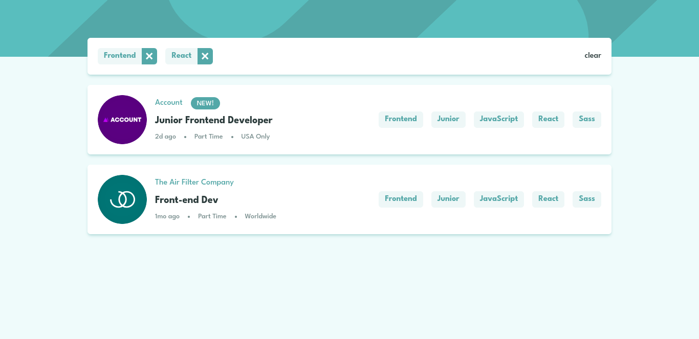

# Frontend Mentor - Job listings with filtering solution

This is a solution to the [Job listings with filtering challenge on Frontend Mentor](https://www.frontendmentor.io/challenges/job-listings-with-filtering-ivstIPCt). Frontend Mentor challenges help you improve your coding skills by building realistic projects.

## Table of contents

- [Overview](#overview)
  - [The challenge](#the-challenge)
  - [Screenshot](#screenshot)
  - [Links](#links)
- [My process](#my-process)
  - [Built with](#built-with)
  - [What I learned](#what-i-learned)
- [Author](#author)

## Overview

### The challenge

Users should be able to:

- View the optimal layout for the site depending on their device's screen size
- See hover states for all interactive elements on the page
- Filter job listings based on the categories

### Screenshot

### Links

- Solution URL: [https://github.com/coderSuresh/static-job-listings-master](https://github.com/coderSuresh/static-job-listings-master)
- Live Site URL: [https://job-search-static.netlify.app/](https://job-search-static.netlify.app/)

## My process

### Built with

- React
- Tailwind CSS

### What I learned

I learned how to use Tailwind CSS in React. I also learned how to use the different array methods like `filter`, `map`, `every`, and `includes`.

- `filter` - The `filter()` method creates a new array with all elements that pass the test implemented by the provided function.

- `map` - The `map()` method creates a new array populated with the results of calling a provided function on every element in the calling array.

- `every` - The `every()` method tests whether all elements in the array pass the test implemented by the provided function. It returns a Boolean value.

- `includes` - The `includes()` method determines whether an array includes a certain value among its entries, returning true or false as appropriate.

## Author

- Frontend Mentor - [@codersuresh](https://www.frontendmentor.io/profile/codersuresh)
- Linkedin - [@codersuresh](https://www.linkedin.com/in/codersuresh)
